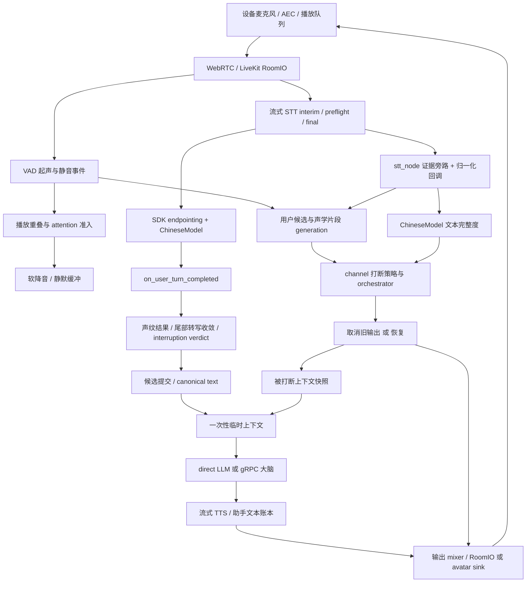

# 全双工级联语音交互分析与优化方案

> 后续实施与新增实测结果见[第一批执行记录](全双工级联优化执行记录-2026-09-05.md)和[第二批执行记录](全双工级联优化第二批执行记录-2026-09-05.md)。本文保留基线分析。

审查日期：2026 年 9 月 5 日（Asia/Shanghai）；上游核查截至当日 15:38 左右。范围：分析、只读验证与方案，不实施修复，不安装/升级依赖，不部署。

## 1. 结论与建议路线

建议保留现有级联和候选协调骨架，先解决**运行环境契约、打断决策所有权、恢复完整性及远端上下文传递**，再校准 EOT 和等待策略。现在直接降低 EOT 阈值、把所有 final 当作话轮完成，或直接切换 native adaptive，都不能充分解决自然交互问题。

本次有六项优先结论：

1. **本地真实安装环境存在启动阻断。**源码向 `AgentSession` 传入 `transcription_timeout`，原始目录虚拟环境安装的 agents 1.6.4 不接受该参数，最小调用已复现 `TypeError`。声明/锁定的 1.7.1 接受它。不能把当前 `.venv`、锁文件和线上运行环境混为一谈。
2. **EOT 完整度仍承担过多打断语义。**默认意图分类器是 Noop；停止、更正、换话题、附和没有实际独立模型。热路径先运行带状态副作用的 `should_interrupt()`，再运行 turn runtime，并使用前者调用前保存的分数。
3. **有界等待已存在，但缺少统一体验预算。**已有 final 且仍 HOLD 时可保留 6 秒 post-speech 窗口；框架完成后另有最多 5 秒的转写 settlement。它们不是每轮固定串联的 11 秒，但会产生条件性长尾和回调排队。
4. **软暂停不等于无损暂停。**静默缓冲最多 2 秒，超出后不保留新帧；恢复依赖下一次 `capture_frame` 触发排空。尾部已经生成完的响应、长 HOLD、恢复与再次取消交错，均需专门处理。
5. **上下文“消费成功”不等于到达大脑。**本地临时 ChatContext 提示未由默认 gRPC 适配器发送；其请求只发用户文本、conversation_id、turn_decision 等。direct LLM 和远端大脑的续接能力不能等同。
6. **证据结构优于纯文本拼接，但尚非完整乱序协议。**已有 stream/revision/span、候选与声学 generation、覆盖与通知租约；没有完整的生产者修订版本和过期拒绝链。已复现同一 revision 的旧 final 覆盖新 final。

优先级：P0 环境/真实构造契约 → P1 单一裁决、输出恢复和上下文跨边界一致性 → P2 多证据 EOT 校准、供应商和 native A/B。下文的改造均为建议，未执行。

## 2. 审查基线与证据范围

### 2.1 目录、commit 与差异

- 原始目录 `R=/Users/manson/ai/eidolon/eidolon_channel`，为当前实现的事实来源，仅只读访问。
- 报告工作树 `W=/Users/manson/.codex/worktrees/d228/eidolon_channel`。
- 两者 HEAD 均为 `7204c7932025e309404ca9b48ad006e4a3979132`。
- 沿两条目录祖先链及原始项目子目录查找，未发现适用的 `AGENTS.md`。未启用子代理。
- 原始目录 git 状态只有 `?? docs/patent/`；报告创建前工作树干净。普通 `git status` 曾触发 LFS clean 写共享 `.git/lfs/tmp` 被沙箱阻止；随后禁用 LFS filter 做只读状态核对，没有请求写原始目录。
- 逐文件比较 528 个跟踪文件：业务文本、配置、测试、锁文件相同；8 个模型资源不同，原因是原始目录为实际模型、工作树为 LFS 指针。包括中/多语言 EOT、pvad、campplus 和四个声纹资源。故所有模型验证从 R 运行，未在 W 下载模型。
- 中文 EOT 模型大小 178152957 字节，SHA256 `e0738b2d2f8cf17ee75fc8ac8a36f2b0a9dcb29f288387df4ab7554f0c3f6317`；工作树同路径仅 134 字节。pvad 为 3940567 字节，SHA256 `2114fd3c3fa87b560eaf4cad6a6e1a0a73aefba08da05521a27bfe2382ef4bdd`。
- 已完整阅读 R 下 `docs/patent/full_duplex_turn_convergence_patent.md`。用户指定的不带前缀 docx 路径不存在；实际文件为 `docs/patent/专利：一种全双工语音对话的轮次收敛与上下文续接方法.docx`。按要求优先 Markdown，未将 docx 排版或原参考专利当作技术证据。

本文代码定位约定：`A/` 表示 `R/eidolon/livekit/agent/`，`P/` 表示 `R/eidolon/livekit/plugins/`，`C/` 表示 `R/eidolon/livekit/common/`；`SDK/` 表示 `R/.venv/lib/python3.13/site-packages/livekit/agents/`。行号对应上述快照。主要结论另给绝对路径链接。引用公开源代码时明确标注版本，避免将 main 分支或旧版行号套用到另一版本。

### 2.2 验证的边界

证据等级：**确定**＝源码契约或确定性反例；**支持**＝已有离线/集成测试支持但非现场；**待实验**＝触发条件可信，尚未测得发生率或用户体验影响量。

本次没有连接真实房间、调用付费 STT/LLM/TTS 服务、录制设备音频或读取线上进程环境。原始 `.venv` 是已验证的本地安装环境，不代表线上部署必定同版。上游源码下载到 `/tmp/eidolon-voice-audit` 供只读比较，没有安装。没有向搜索服务发送私有代码、凭证或配置。

执行现有测试时使用 R 的 Python，设置 `PYTHONDONTWRITEBYTECODE=1 HF_HUB_OFFLINE=1 TRANSFORMERS_OFFLINE=1`，关闭 pytest cache 和 coverage 写入：

| 验证 | 本次结果 | 能证明什么 |
|---|---|---|
| transcript_evidence、user_turn_coordinator、interrupted_context_manager、eot_full_duplex_product_contract 四组 | **45 passed、13 xfailed，9.94 秒** | 重现前次基线；13 个严格 xfail 是未达成契约，不是实现完成 |
| speech_lifecycle、output_flow、playback_turn_evidence、transcript_handler、client_audio、turn_completion_policy、eot_policies 七组 | **55 passed，0.77 秒** | 现有局部行为一致；不覆盖设备实际播放、真实识别、真实启动 |
| 实际 AgentSession 构造参数 | `TypeError: got an unexpected keyword argument 'transcription_timeout'` | 本地 1.6.4 无法执行当前 lifecycle 的该构造步骤 |
| 实际 ChineseModel 的 SDK endpointing 解析 | 非 streaming detector；`fixed/min_delay=0.5/max_delay=3.0` | Agent 层的实际解析，非仅依据默认注释 |
| 同 revision 先 seq=2 final「明天去上海」，后 seq=1 final「明天去北京」 | 最终选择「明天去北京」 | coordinator 未拒绝旧 final；不是供应商发生率证据 |

构造纯 AgentSession 而不挂载 ChineseModel 时，Session 默认 detector 的解析可显示 0.3/2.5；**不能据此断言本项目运行值**。`AgentActivity.endpointing_opts` 会按 Agent 的实际 detector 重新解析；ChineseModel 是文本 detector，实测为 0.5/3.0。这也是必须检查实际调用契约的原因。

## 3. 真实链路和所有权

### 3.1 当前有效配置与入口分支

在 R 内实际调用 `load_effective_config()`，只输出非敏感配置，结果为：Bailian STT、Bailian TTS、FireRed pvad、`eidolon_agent` 远端大脑，`balanced_semantic`、`interruption_owner=channel`。配置加载为 profile 默认值叠加 YAML/可选 overlay；设备 metadata 再决定 interaction mode。未核实线上环境变量覆盖。

`A/server.py:460–505` 和 `A/server.py:556–560` 的真实分支是：

| 模式 | 实际 pipeline | 输入/提交及打断 owner |
|---|---|---|
| full_duplex + channel | StreamingPipeline | 双向音频；SDK endpointing 候选完成，channel 裁决 duck/cancel/resume；最终准入由 completed hook 协调 |
| full_duplex + livekit_native_adaptive | StreamingPipeline | SDK 自动打断；channel 热路径跳过本地语义裁决和 speech-start interruption candidate；产品候选/准入仍在 |
| half_duplex | StreamingPipeline | 自动采集/端点提交，但 `allow_interruptions=False`；不建立 barge-in 候选、不安装 duck mixer；框架可屏蔽不可打断输出期间输入 |
| ptt | HalfDuplexPttPipeline | 按键捕获完整 segment 后识别/提交，显式停止可立即生效；不用本报告的自然 EOT 等待逻辑 |

**纠正配置注释**：`config/settings.yaml:127` 写着 half-duplex 总是 segment PTT，但与上述实际入口冲突。`runtime/interaction_mode.py:207–227` 和 `_use_ptt_pipeline` 才是证据。不要按这个注释制定迁移方案。

`full_duplex/turn_handling.py:58–74`：channel owner 使用 `interruption.enabled=False` 与 `discard_audio_if_uninterruptible=False`，保留双讲输入；accepted cancel 通过 `session.interrupt(force=True)` 取消框架默认不可打断的 handle。native owner 才置 enabled、adaptive 和 false-resume。avatar sink 不支持同样的 pause 时显式关闭框架 false-resume；恢复能力需独立验收。

这一 owner 配置还有显式 SpeechHandle 例外：`agent_builder.py:83` 对欢迎语使用 `say(..., allow_interruptions=True)`，覆盖普通回复默认值。SDK 1.6.4 `agent_activity.py:1217/1817` 及 1.7.1 的对应路径检查当前 handle 可打断性，不只看 Session enabled。因此欢迎语（包括 half_duplex 的欢迎语）可能仍由 SDK 的音频活动路径暂停/打断，受 AEC warmup 和最小时长限制。应在真实启动后的首轮实验验证，不能宣称 channel 配置已经对所有 speech 消除了 SDK 动作。

### 3.2 端到端流程

这是已接线的概念流程，不表示 Ctx 到远端大脑的提示已传递成功；该缺口见 F08。VAD 与 STT 对同一输入并行，不是必须先完成 VAD 再识别。

关键位置：

| 边界 | 代码与实际行为 |
|---|---|
| 音频采集/AEC | Web avatar `eidolon_client_web/src/avatar/components/CompanionScene.tsx:199`、mobile `lib/src/services/eidolon_session.dart:34` 请求 echoCancellation/noiseSuppression/AGC；ESP AFE `main/audio/processors/afe_audio_processor.cc:42–72` 依板级编译配置启用。请求启用不证明消回声质量；server 的 AEC warmup 是输入/打断保护，不是 AEC 算法 |
| VAD | `A/factory.py` 构造 FireRed；`P/vad/firered/vad.py:243` 单独 executor；阈值 0.5、起声 100ms、静音 500ms、前缀 300ms；`A/full_duplex/speech_lifecycle.py:103/140` 更新 EOT VAD 状态 |
| STT 修订 | `P/stt/bailian/speech_stream.py:742` 写 task/sentence/span/finality 元数据；`A/full_duplex/agent_builder.py:24` 在 yield 给 SDK 前观察原始 SpeechEvent；`transcript_evidence_buffer.py:60` 以 text+final 回配元数据 |
| 候选/修订 | `A/session/user_turn_coordinator.py:228/308/622` 合并声学片段、选择修订和完成 readiness；`full_duplex/transcript_recorder.py:51–106` 连通生产数据到 coordinator/reconciler/EOT |
| EOT | `P/eot/models/base.py:272` 只取最后一条用户文本评分；SDK `voice/audio_recognition.py:1311` 调用文本 detector，再按概率选择端点等待 |
| 打断 | `A/full_duplex/transcript_handler.py:105–166` 由 owner/输出/attention 判定是否执行；`A/session/semantic_interrupt.py:58` 和 `turn_policy/runtime.py:71` 产生决定；`interruption_orchestrator.py:192` 管候选和终态 |
| 提交 | `A/full_duplex/framework_completed_turn.py:162/340` 等 settlement、校对 verdict、发布 canonical user text/提交元数据；拒绝则 Agent hook 抛 StopResponse |
| LLM/TTS | `A/factory.py:288` 默认远端 gRPC；`eidolon_agent_rpc/grpc_llm.py:375` StartTurn，`:645` 取消时异步 CancelTurn；`full_duplex/agent_builder.py:36` 观察送入 TTS 的文本流 |
| 播放及上下文 | `A/output/controller.py:522` 路由输出帧；`full_duplex/interruption_effects.py:255–348` 停播副作用；`context/interrupted.py:33/116` 捕获/消费临时提示 |

### 3.3 SDK 契约与“完成”的含义

本地 1.6.4 源码、公开 1.7.1 和 1.8.0 的相关文件均已读取。后两者 `turn.py` 的文本 endpointing 默认值仍是 0.5/3.0，**升级不自动接通本项目 `get_dynamic_silence_threshold`**。公开版本定位：[1.7.1 turn.py](https://github.com/livekit/agents/blob/livekit-agents%401.7.1/livekit-agents/livekit/agents/voice/turn.py#L113)、[1.7.1 AudioRecognition](https://github.com/livekit/agents/blob/livekit-agents%401.7.1/livekit-agents/livekit/agents/voice/audio_recognition.py#L1494)。

- STT final 表示供应商的某一识别片段定稿；一句可能包含多段，用户也可能 final 后继续补充。它不是产品话轮完成。
- 文本 EOT 的概率表示模型对文本结束的估计，不是“想打断概率”，也不是经中文场景校准后的真实概率。
- SDK 完成回调没有本项目原生 candidate/generation 和严格的“覆盖水位”；本项目以文本和已记录 revision 推断。不能说框架已提供专利中的全序账本。
- SDK 普通插件转写的规范化事件省略部分元数据，当前 stt_node 旁路有实际价值；但 text+final 回配只是兼容桥，不是可靠跨流身份。
- 本地 `AgentActivity:2137–2142` 会等待上一个 `on_user_turn_completed` 完成，而非取消它。5 秒 settlement 能阻塞后续完成处理；不能依赖 SDK 自动取消过期用户 hook。
- 临时 ChatContext 是 SDK 给本轮推理的副本，适合临时提示；该保证只到 LLM 插件入口，不能替代远端 RPC 的序列化验证。

## 4. 核心发现：触发条件、影响与可信度

### F01 · P0：声明、锁定、安装不一致，真实构造失败

**确定。**[lifecycle.py:52](/Users/manson/ai/eidolon/eidolon_channel/eidolon/livekit/agent/full_duplex/lifecycle.py:52) 无条件传 `transcription_timeout`。已安装 [AgentSession:226](/Users/manson/ai/eidolon/eidolon_channel/.venv/lib/python3.13/site-packages/livekit/agents/voice/agent_session.py:226) 的签名没有它；复现结果见第 2 节。这是当前本地环境在走到会话构造时的明确失败，不是猜测体验退化。

1.7.1 已有该参数，含义为 VAD 停止后无非空 final 的通知，非“帮所有候选等完 5 秒再提交”；见 [1.7.1 参数说明](https://github.com/livekit/agents/blob/livekit-agents%401.7.1/livekit-agents/livekit/agents/voice/agent_session.py#L486)。必须先把环境和声明对齐，再跑真实 lifecycle。保留本次测试结果作为组件基线，不作启动合格证。

### F02 · P1：模型完整性与打断意图耦合

**确定的能力缺口；准确率影响待真机。**[intent_classifier.py:45](/Users/manson/ai/eidolon/eidolon_channel/eidolon/livekit/agent/turn_policy/intent_classifier.py:45) 恒返回 uncertain；ONNX 类构造直接 NotImplementedError。`decider.py:150` 用 score≥0.70 取消；`:163` 在 final、VAD inactive、0<score≤0.20 时回滚。模型 hint 即使注入，也主要是附带字段，并不自动获得停止/更正的动作权。

离线实测（本地真实 ONNX，单条文本，不带声学和多轮语境）：

| 文本 | EOT score | 局限 |
|---|---:|---|
| 不要讲了 | 0.212130 | 低于框架 0.5 和取消 0.7 |
| 换个话题吧 | 0.384019 | 同上 |
| 不是，我说的是明天 | 0.118185 | final+静音时可能进入低分回滚 |
| 就这样吧 | 0.100144 | 相同风险 |
| 我想先了解一下 | 0.397092 | 未完表达也在长等待区间 |
| 停 | 0.985870 | 完整度高，但 `update_asr` 的长度门槛会令此短文本 cached score 为 0 |

因此不能得出“所有短停止句模型都低分”；更不能据六句改关键词表/下调全局阈值。需要独立的停止/改正/换题/附和标注，允许低 EOT 的明确停止先停播，之后继续收集用户内容。`playback_turn_evidence.py:48–66` 只对 normal interrupt 继续 LLM，对 hard stop 单独处理；若接入 correction/topic intent，必须同步审查终态消费端，否则新标签可能不能完成动作。

### F03 · P1：热路径有两套裁决，且先读旧分数、后写冷却

**确定。**[semantic_interrupt.py:66](/Users/manson/ai/eidolon/eidolon_channel/eidolon/livekit/agent/session/semantic_interrupt.py:66) 先读取 score，再调用 `should_interrupt`，duck 分支随后忽略 should_cut 而走 runtime。后者使用的是旧 score；[base.py:484](/Users/manson/ai/eidolon/eidolon_channel/eidolon/livekit/plugins/eot/models/base.py:484) 会重算当前 score，在策略认为 cut 时先 `record_interrupt`，而此时实际输出可能最终 HOLD。

语义链 `eot_policy.py:444` 按冷却、最小时长、VAD 稳定、重复、最大时长/陈旧状态与 EOT 顺序短路；runtime 的字符/final/score 策略并未统一消费该链的否决结果。结果既可能“没有真停播但提前记冷却”，也可能“语义链否决但 runtime 仍按此前高分取消”。13 个 xfail 中已有单 owner 契约；具体现场频率尚无证据。

此外，欢迎语的显式 allow_interruptions=True 又打开了 handle 层例外（第 3.1 节）；单 owner 验收必须覆盖欢迎、固定 say、普通回复和错误提示。建议将 scorer 变为无副作用的、带 evidence version 的结果，只有实际输出动作获得执行资格后记录动作冷却；一个事件只进入一个裁决入口。不要简单删掉前置调用而丢失其有效防噪证据。

### F04 · P1：EOT 计时与模型执行存在隐藏行为

**确定的代码行为；延迟影响待负载测试。**[base.py:404](/Users/manson/ai/eidolon/eidolon_channel/eidolon/livekit/plugins/eot/models/base.py:404) 的 200ms debounce 每次到达都更新时间戳。持续小于 200ms 的更新可能一直推迟新推理；final 也仍要求长度≥3。被跳过时可沿用旧文本分数；短文本只清 `_current_eot_score` 而不是所有状态中的 score。

`predict_end_of_turn(timeout=...)` 接受 timeout 但未使用；内部是同步 tokenizer/ONNX，`async` 方法没有将计算交给专用执行器。`eot_backend.py:122–165` 清部分标点、取尾部最多 128 token、异常返回 0；`supports_language` 恒 True。实际不是多轮语境模型，也没有通过这些代码证明中英混说可用。`eot_manager.py:93` 的 50ms 同文本缓存能减重复开销，不能保证 event loop 延迟上界。

`get_dynamic_silence_threshold` 和 normal `_policy_chain` 虽构造出来，当前 SDK endpointing 路径没有调用它们；正常话轮端点不能享受其“多证据动态断句”注释所描述的能力。建议先修“最后推理时间/文本版本/错误态”定义，并将模型故障与低结束概率分开，不把所有失败映射成用户没说完。

### F05 · P1：等待有上限，但 final 不能缩短部分窗口，且 merge 不是保底等待

**确定。**[interruption_orchestrator.py:480](/Users/manson/ai/eidolon/eidolon_channel/eidolon/livekit/agent/session/interruption_orchestrator.py:480) 在 active speech 时从起声计预算，停止后从 stopped_at 重新计 post-speech；有文本（含 final）仍可使用完整 6 秒。无文本或短 Latin provisional 为 800ms。`:383` 的等待还受 250ms 最小发声和最后 action 限制，不是所有停顿都等 6 秒。

`DuckSuspendTimeoutHandler:64/120` 先等 450ms，再按剩余 owner 预算重排 timer；新转写回调可直接解析取消/回滚，不必等 timer，但低分 HOLD 的新证据不一定缩短已设期限。stable-signal recheck 另有 350ms；VAD inactive 会清其候选。普通稳定提升需要至少两次检查和前缀一致，不能等同“文本 350ms 未修改即自然结束”。

[transcript_settlement.py:41](/Users/manson/ai/eidolon/eidolon_channel/eidolon/livekit/agent/full_duplex/transcript_settlement.py:41) 使用版本通知和硬 deadline，是已实现的优点；不过 timeout 从 hook 内开始，candidate check 只比较 candidate_id。它不能因同一产品候选新增一个声学 generation 就一律作废，那会破坏自然续说；需要区分合法扩展与替换。

`user_turn_coordinator.py:228` 的 800ms 只决定**仍 open** 的候选是否合并下一段，不会强制让高分、已被 SDK 完成的候选继续留开 800ms。对半句长停顿的容忍也不能仅靠加大这一值。VAD 停止回调本身已含静音检测延迟，merge 的间隔是事件层间隔，非人工标注的真实声学停顿。

### F06 · P1：修订/覆盖存在，但还不能可靠阻挡乱序和缺失

**确定。**[user_turn_coordinator.py:308](/Users/manson/ai/eidolon/eidolon_channel/eidolon/livekit/agent/session/user_turn_coordinator.py:308) 按身份/span/文本定位 segment 后直接赋值，没有 sequence 新旧检查；旧 final 反例已复现。`C/transcript_evidence.py:94` 已避免两个明确不同 stream 的 revision 相等被误认，值得保留。

Bailian `sequence=int(sentence_id)`：这是**句子编号**，不是同一句 interim→revision→final 每次修订递增版本；不能直接将其当 revision version。其任务 ID、句子 ID 和时间区间已有生产接线；SenseTime 流提供 `words=[]`、aligned_transcript=False，没有等价的自定义 revision 元数据。其他插件即便兼容 SpeechEvent，也不意味着具备同样证据能力。

`TranscriptEvidenceBuffer` 长度 64、匹配键仅 text+final，重复说同一句、preflight 未被消费、不同流晚到回调有错误配对风险。`framework_completion_readiness:640` 无 final 时可立即 ready；有 final 时主要等未被覆盖的 interim，不是通用的区间覆盖证明。收到尾部 final 后可以 ready，即使原 completed 文本没有该尾部，随后 prepare 合并候选。这是当前代码的务实收敛机制，但需要注明文本推断的置信级别。

建议增补 producer epoch、revision identity 与可选 source revision version；在同源范围内拒绝过期，区间用覆盖集合/缺口而非单个最大值；字段缺失时采用可观测的兼容策略。不要把各来源 sequence 比成全局版本，也不要拿内容 hash 唯一识别一次话轮（用户会重复相同句子）。

### F07 · P1：幂等键保证有限；恢复缓冲与异步输出有风险

**确定的边界，部分竞争待注入验证。**[pipeline.py:477](/Users/manson/ai/eidolon/eidolon_channel/eidolon/livekit/agent/full_duplex/pipeline.py:477) 去重是内存 set `(turn_id,event,reason)`；无 turn_id 直接允许。同步 check/add 在单事件循环内没有 await，能拦同键重复；它不是跨 reason、跨动作域统一终态，不包含 output response ID，也没有失败状态回收协议。`full_duplex/state_machine.py:38–42` 的阶段转换图仅记录异常，不执行拒绝或阻止；实际约束分散在 coordinator、orchestrator 和 output controller 中，不能把阶段图误当执行型统一状态机。

[interruption_effects.py:255](/Users/manson/ai/eidolon/eidolon_channel/eidolon/livekit/agent/full_duplex/interruption_effects.py:255) 先占键、快照，再发送 best-effort stop、清缓冲、finish、resolve，最后 forced interrupt。publish 返回意味着任务已入队，不是设备已确认停止；局部异常/异步发送失败后不能靠重复事件无条件重试，已占键可能阻止重试。

[controller.py:578](/Users/manson/ai/eidolon/eidolon_channel/eidolon/livekit/agent/output/controller.py:578) 缓冲满后不保存后续帧；TTS 仍生成，因此 6 秒静默 HOLD 与 2 秒保留不等价于完整可逆恢复。`:422` unduck 只改状态，`:533` 后续新帧触发排空；若最后一帧早已到达，不能仅凭 unduck 宣称尾部会恢复。`:598` 遍历缓冲时 await，下游背压期间若取消/再 duck/清缓冲，需验证已取出的帧和接下来的 incoming frame 不会越过新输出状态；这是待故障注入的竞争风险，不宣称已测到实际漏音。

建议输出 owner 绑定 response/playout epoch，恢复有独立 drain 完成机制；缓冲用背压/真正 pause 或明确可恢复窗口。先测再选，不盲目把缓冲改成 6 秒（这会放大生成速度、内存和晚恢复问题）。

### F08 · P1：默认远端大脑未收到本地一次性提示，且缺少候选绑定

**确定。**[interrupted.py:116](/Users/manson/ai/eidolon/eidolon_channel/eidolon/livekit/agent/context/interrupted.py:116) 消费前清空 pending，成功与失败都不泄漏到下一轮；TTL 默认 30 秒、历史回退默认关闭，是合理的现有保护。快照只有 text/timestamp/played_seconds/source，没有 response/candidate/generation 绑定；失败捕获也不必然清除旧快照。

[grpc_llm.py:259](/Users/manson/ai/eidolon/eidolon_channel/eidolon/livekit/agent/eidolon_agent_rpc/grpc_llm.py:259) 只从 ChatContext 提取最后用户文本；`:375` StartTurn 不序列化 system 提示。`CommittedTurnDecision` 只有提交证据和文本 hash，没有被打断片段或已听边界。因此**本地 outcome=applied 不能证明默认远端推理有此上下文**。这不排除远端自身有历史，但它无法据当前请求获得本地此次新增的播放提示。

播放秒数 [controller.py:273](/Users/manson/ai/eidolon/eidolon_channel/eidolon/livekit/agent/output/controller.py:273) 是已转发到 inner sink 的样本数，非设备实际播放确认。提示截取最多 120 字也不是词级对齐的已听文本。建议明确“估算/已确认”两类边界；typed interruption context 随 accepted turn request 传输，远端明确作为临时上下文使用，响应回执证明已使用。拒绝、替换、重试时遵循绑定状态，不将提示长期写入历史。

附带问题：`eidolon_sdk/biz/dialogue_control/turn_decision.py:73` 在产品 commit 时硬写 transcript_final、vad_terminal=True；候选 deadline 可能包含 interim。这里应定义成“产品已定案”还是“供应商 final/声学终止”，否则跨服务元数据会把推断伪装成观测。

### F09 · P1：播放状态乱序只诊断，不能等同可用新证据

**确定。**[room_data.py:109](/Users/manson/ai/eidolon/eidolon_channel/eidolon/livekit/agent/session/room_data.py:109) 先覆盖当前状态，再记 seq reordered/reset；没有拒绝旧包。freshness 按 received_at，迟到包仍可能被当作新状态参与 attention。Web publisher `useClientAudioStatePublisher.ts:120` 心跳走不可靠通道、状态变化走可靠通道，更需处理不同投递路径及重连 epoch。

ESP Korvo `eidolon_voice_controller.cc:2808` 收到 stop 后调用 StopLocalPlayback，并 ACK completed/failed，是已有设备能力；handler 忽略 payload，不能在此确认 output identity。channel 的 `client_control_publisher.py:129–217` 仅记录入队/发布，没有等待这个 ACK 来确定本次物理停播。Web/mobile 本次所查接线没有找到同等 response-bound stop ACK。不能笼统声称“所有客户端都没 ACK”，也不能把 ESP ACK 当整个系统已闭环。

### F10 · P2：异常与超时没有共同截止语义

**支持/待集成。**声纹 hook `framework_completed_turn.py:85` 直接 await task，局部没有 deadline；上游 task 可有自身约束，但不能由这里推导整轮硬上界。settlement deadline 后 `:215–235` 使用 best-known candidate，需对不稳定数字/实体提供明确降级策略。

1.7.1 的无 final 通知已接到 `turn_completion.py:41`，该 handler 仅拒绝 selected_text 为空的候选；有 interim 但丢 final 的场景会跳过，不能认为“5 秒后所有丢 final 都恢复”。SDK completed hook 在 interruption owner 仍 HOLD 时返回 False/StopResponse；后续是否还有完成机会取决于新证据与 SDK 状态，不能依赖“再来一次 callback”。

gRPC 适配器已区分不可重试错误、收到首个模型活动与首个答案，并在取消后异步发 CancelTurn，见 `grpc_llm.py:66/402/645`。不过本地 stop、远端取消确认和远端历史落盘仍是不同事件；StartTurn 请求超时但服务器已接受、后续 retry 的重复请求风险要做跨边界回放，不应无证据要求数据库事务。对于已取得 turn_id 后首 delta 超时，现有 `grpc_llm.py:428–451` 已发 CancelTurn并设 retryable=False，不能把所有超时都描述成重复重试。

TTS还有独立的首音路径：`P/tts/bailian/tts.py:633–642` 接入 SentenceAggregator，当前普通软门槛12字、硬上限80字、idle 300ms，首段4字/遇标点更早flush；这是输出合成分块，不是用户EOT。连接池获取上限12秒、task started15秒、首token15秒、token间隔10秒，是不同故障条件；`:697–729` 的5秒无首音guard从首次send_continue成功起算，并按1秒间隔检查，实际触发还含检查粒度及调度。`A/session/provider_events.py:459–489` 的3000ms首delta watchdog主要记观测，不等于RPC的强制超时。应测“输入已提交→大脑活动→可合成文本→供应商音频→扬声器”，不能把3000ms指标当全链路硬上限。

## 5. 延迟预算：不能简单相加配置值

| 时钟/证据 | 当前值及接线 | 正确解释 |
|---|---|---|
| VAD 起声/静音 | 100/500ms，effective config → VAD | 先有检测延迟，再有上行/调度延迟；不是本地听到声音即触发 |
| Bailian final silence | YAML 400ms，插件供应商配置 | 与 VAD 静音并行，但受供应商转写与网络影响；不是产品最终性 |
| SDK 文本端点 | 0.5/3.0s；score<0.5 走 max | 1.7.1 `audio_recognition.py:1661` 扣除 last_speaking_time 已过去时间，不能再固定加上 500ms VAD |
| merge grace | 800ms | open 候选的合并条件，非每轮强制额外等待 |
| 软降音 | 30ms fade，volume 0 | server 混音斜坡；已在设备/网络队列中的帧不因此立即消失 |
| 初判/稳定 | 450ms 初判；normal 350ms；weak followup 1500ms | 条件性重检/保持，不是串联每轮必经 |
| post-speech evidence | 6000ms，no evidence 800ms | 从停声事件计时；final 不自动缩短；新证据可能提前解决 |
| framework false interrupt | 6000ms | 主要对 native 或显式可打断 say 的 false-resume 生效；channel 普通回复自动打断 disabled，不能算成另一段必经等待 |
| transcript settlement | 最多 5000ms | completed hook 内启动，尾部 ready 可立即结束；可阻塞后续 hook |
| SDK transcription_timeout | 5000ms，1.7.1 才支持本项目构造 | 缺 final 的告警/恢复时钟，非 endpointing min/max，也不是 settlement 的同一个 timer |
| AEC warmup | 显式 1000ms | SDK 初期音频保护，可能影响一开始的插话；不是 AEC 收敛已完成证明 |
| LLM/TTS/队列 | 默认远端 RPC + Bailian | EOT 决策后还有模型、首段文本分块、TTS 首包、排队、解码/播放；本次未测 |

可测分解应是：

`真句末→首个可听音 = 端点与证据关键路径 + 完成hook排队/准入剩余等待 + LLM有效首文本 + TTS首包/分块 + 下行/设备实际播放`。

VAD/STT/EOT 的重叠段取真实 trace 关键路径，不能机械求和；逐轮还应记录每段从哪一条证据起算、何时被新证据解除。并分别统计 `起声→server duck`、`起声→device attenuation`、`起声→旧响应实际最后音`，避免把“stop_sent”当停播时延。

## 6. 依赖与上游核查

### 6.1 服务端版本矩阵

来源：`pyproject.toml:23`、`uv.lock:838` 起、R 的 importlib.metadata；上游直接访问官方 PyPI JSON、官方 GitHub release/tag 源码。稳定版指非预发布、未撤回包；以下是核查时快照，并非建议一律升级。

| 包 | 声明 | 锁定 | 实装 | 当天上游稳定版 | 判断 |
|---|---|---:|---:|---:|---|
| livekit-agents | >=1.7.1,<1.8 | 1.7.1 | **1.6.4** | **1.8.0** | 先对齐锁定版；1.8 超出声明范围 |
| livekit-plugins-openai | >=1.7.1,<1.8 | 1.7.1 | **1.6.4** | **1.8.0** | 与 agents 一组兼容验证；非默认 Bailian 插件的升级替代品 |
| livekit（rtc） | agents 传递精确依赖 | 1.1.15 | **1.1.12** | **1.1.17** | 1.6.4 pin 1.1.12；1.8 pin 1.1.17，不单独越级换 FFI |
| livekit-api | >=1.2.1,<1.3 | 1.2.1 | **1.1.0** | 1.2.1 | 对齐服务端 API，不宣称提升 EOT |
| livekit-protocol | 传递 | 1.1.26 | 1.1.18 | 1.1.26 | 随兼容组合 |
| livekit-local-inference | 传递 | 0.2.7 | 0.2.6 | 0.2.7 | native/local inference 相关 |
| livekit-blingfire | 传递 | 1.1.0 | 1.1.0 | 本次未独立查最新 | 不无依据升级 |
| openai | 传递 | 2.54.0 | 2.36.0 | 3.8.0 | **不升 3.x：agents 1.8 元数据要求 openai<3** |
| onnxruntime | >=1.19 | 1.26.0 | 1.26.0 | 1.29.0 | 先测现有模型/平台，升级不能修正模型意图 |
| transformers | >=4.40 | 5.8.0 | 5.8.0 | 5.16.1 | tokenizer 一致性、中文分数回归和本地加载需验证 |
| torch / torchaudio | >=2.2 / >=2.2 | 2.10.0 / 2.11.0 | 同锁定 | 2.14.0 / 2.11.0 | 版本不同先核验实际 wheel/ABI 与调用；本次未证明二进制兼容失败，不能仅按号强制同步 |
| websockets | >=12 | 15.0.1 | 15.0.1 | 17.1 | 供应商连接/重连/取消契约优先，不为 EOT 盲升 |
| aiohttp | >=3.9 | 3.13.5 | 3.13.5 | 3.14.3 | 独立评估连接池/超时；上游 1.7.1 release 提及安全依赖更新 |
| numpy | >=1.26 | 2.4.4 | 2.4.4 | 本次未独立查最新 | ONNX 音频数据兼容依赖，无已证实升级必要 |
| eidolon-sdk | editable ../eidolon_sdk | 0.1.0 | 0.1.0 | 本地私有，不适用公共最新 | 不能靠包 version 锁行为，应记录仓库 commit |

官方元数据链接：[agents](https://pypi.org/pypi/livekit-agents/json)、[rtc](https://pypi.org/pypi/livekit/json)、[api](https://pypi.org/pypi/livekit-api/json)、[OpenAI plugin](https://pypi.org/pypi/livekit-plugins-openai/json)、[protocol](https://pypi.org/pypi/livekit-protocol/json)、[local inference](https://pypi.org/pypi/livekit-local-inference/json)、[OpenAI Python](https://pypi.org/pypi/openai/json)、[ONNX Runtime](https://pypi.org/pypi/onnxruntime/json)、[Transformers](https://pypi.org/pypi/transformers/json)、[Torch](https://pypi.org/pypi/torch/json)、[Torchaudio](https://pypi.org/pypi/torchaudio/json)、[Websockets](https://pypi.org/pypi/websockets/json)、[aiohttp](https://pypi.org/pypi/aiohttp/json)。

agents/plugin 1.8.0 PyPI 上传于 9 月 5 日 UTC 00:10/00:11；GitHub agents 1.8.0 发布于 UTC 07:09（本次审查当日），1.7.1 发布于 8 月 27 日。rtc 1.1.17 包上传于 9 月 1 日。依赖号受约束，不应将“最新”解释为“当前可直接解析安装”。

### 6.2 值得采用的上游改进与迁移风险

[1.7.1 发布记录](https://github.com/livekit/agents/releases/tag/livekit-agents%401.7.1) 的相关改进包括：避免重复 agent speech end、adaptive 不再要求词时间戳、interruption verdict 绑定 agent speech、playback evidence 归属自身 segment、关闭识别时保留 cancellation。它们与本任务边界高度相关，但**不会修复本项目 Noop 意图、6 秒预算或 RPC 提示缺失**。

[1.8.0 发布记录](https://github.com/livekit/agents/releases/tag/livekit-agents%401.8.0) 包括麦克风 track replacement、恢复语音时 endpointing overlap、dynamic endpointing 排除 agent speech、释放过期 transcript gates/playout pauses、恢复 speaking state，以及 rtc 1.1.17。建议作为第二实验臂，测试恢复与迟到事件是否改善；当日新发布版本不宜未经设备回归直接替换基线。

native adaptive 的实际前提不同：1.6.4 `SDK/voice/agent_activity.py:4006` 要求 streaming/aligned STT，SenseTime 不满足；1.7.1 `agent_activity.py:4718` 已移除此限制。仍需 VAD、兼容 turn detection、detector 服务可用。发生不可恢复错误时上游会退到 VAD interruption（1.7.1 `:4649`），**不是自动退回 channel 语义 owner**。日志写 native enabled 也不证明 detector 初始化成功，应观察 resolved owner 和 fallback。

相关破坏性/行为变化：1.7 引入本项目已使用的 timeout 契约；structured turn_handling 虽在本地 1.6.4 已存在，不能据此推断新参数同样存在。rtc 精确 pin、openai<3、默认 detector 与 endpointing 分支、pause/false-resume 行为及 avatar 能力都必须用版本矩阵测试。当前自定义 VAD/STT/TTS并不等于上游同名 plugins，新增 Silero/其他 STT 插件不是必选动作。

### 6.3 已发现的客户端和本地关联仓库

| 仓库 | HEAD | 声明/锁定/本地可见安装 | 官方最新与建议 |
|---|---|---|---|
| eidolon_client_web | ecc5c69ec043557c1afd4c9c5f580ec28bfa6958 | livekit-client ^2.5.1 / 2.18.6 / 2.18.6；components-react ^2.9.3 / 2.9.20 / 2.9.20；server-sdk ^2.6.1 / 2.15.1 / 2.15.1 | client 2.22.2、components 2.9.24、server-sdk 2.18.0；只将前者列入音频重连 A/B，不把 token SDK 当 EOT 修复 |
| eidolon_client_mobile | 7fc23898d3142453eddea615d6923f7dfb5104cc | livekit_client ^2.8.1 / 2.8.1 / package_config 指向 2.8.1；flutter_webrtc 本地 1.4.0 | livekit_client 2.11.0；需 Flutter/平台音频回归，不推断当前 App 安装包版本 |
| eidolon-client-esp32 | e472eeefac3b6c42735284e13a97dfa6801e1547 | manifest与dependencies.lock:1290 固定 fork commit 502ce391bf01c47dea74e1dd651c5b8945ca8906；managed component 0.3.10~1 | 上游 v0.3.10；不是简单落后版本 |
| eidolon-client-esp32-korvo-1 | 52938310ac7cbdba5107c9ae9ec34bb74ea026b9 | manifest与dependencies.lock:1359 固定 fork 312ce4742b35f92e47915a161d271f7ef027ce5a；managed 0.3.10~2 | 保留私有补丁后逐设备验证 |
| vendor/client-sdk-esp32 | 312ce4742b35f92e47915a161d271f7ef027ce5a | 0.3.10~2；esp_capture ~0.8、av_render ~1.0、esp_peer ~1.4.2 | 不能用裸 upstream 覆盖 fork；manifest 已说明音轨释放及 data channel 协商补丁 |
| eidolon_sdk | 9872d7d6102ead8a8287aa18dd533fbaa39cd231 | editable 0.1.0 | 需与 channel 的提交/上下文协议联测 |

客户端 HEAD 只用于定位，本次没有逐文件审计全部客户端工作区差异；引用位置按实际文件内容，不把 commit 等同已出厂固件。

[JS 2.22.2 release](https://github.com/livekit/client-sdk-js/releases/tag/v2.22.2)（9 月 1 日）含重连后远端 ICE candidate 缓冲、signal reconnect 事件刷新、丢 data stream chunk 报错修复；有重连收益依据，无“必然降低打断时延”的证据。[Flutter 2.11.0](https://github.com/livekit/client-sdk-flutter/releases/tag/v2.11.0) 与 [pub 元数据](https://pub.dev/api/packages/livekit_client) 核实版本，变更涉及音轨/重连状态、依赖和 RoomOptions；具体麦克风/AEC收益须实测。[ESP32 v0.3.10](https://github.com/livekit/client-sdk-esp32/releases/tag/v0.3.10)（6 月 23 日）主要升级依赖，本地已经基于该版本加补丁。npm 元数据：[client](https://registry.npmjs.org/livekit-client/latest)、[components](https://registry.npmjs.org/@livekit/components-react/latest)、[server-sdk](https://registry.npmjs.org/livekit-server-sdk/latest)。

## 7. 对专利补充的独立判断

专利提供术语和结构参考，不是实现标准，也不能据其推导现有性能。

| 专利概念 | 当前实现与判断 |
|---|---|
| 候选与代际 | 已有产品 candidate 与声学 generation；generation 主要随新声学片段增长，不等同同一候选的“全局失效版本”。保留这个区分 |
| 多源证据账本 | 已有转写字段、timeline、verdict；未实现所有事件的统一可比较序号/完备覆盖协议。优先补必要身份，不建设无收益的大账本 |
| 有界通知租约 | TranscriptSettlementLease 已实现版本唤醒、避免 lost wakeup、deadline 与 candidate replacement；不能称尚未实现。应补身份/终态契约，不重写成轮询 |
| final 缩短等待 | 动态阈值函数有局部实现，但未接 SDK；post-speech final 不自动缩短。可实验自适应预算，但 final 不能证明不会继续说 |
| 双动作域原子令牌 | 现有 set 去重不是专利的完整 CAS/动作完成恢复。单 loop 内短同步原子状态足够起步，不需要数据库事务 |
| 播放偏移/一次性续接 | 本地近似和临时消费已做；设备确认、候选绑定和默认 RPC 传递未闭环 |
| 新颖度、信号优势与完整度的合取 | 不宜照搬。用户常引用助手原词纠错，低新颖度不等于回声；明确停止不应被低完整度否决 |

数学表述的主要问题：

1. 专利将 `k_i` 定义为同一源内序号，却对所有源 `sort_k`，并用 `k_i≤v` 与账本版本 v 比较；不同源序号不可比较。若 v 是本地 append version，应独立于 provider sequence，排序仍须标记 source/epoch。
2. `p_tail=max(p_i)` 和 `p_f≥p_tail` 只在同一时间基准、连续无缺口覆盖、无反向修订下才充分。最大结束点不能证明中间无洞；revision 替换关系也不是普通数值大小。
3. `B(q,F)` 的 clipped 单调预算在 q∈[0,1]、Bmin≤Bmax、ρ∈[0,1] 时数值有界；但若每次事件都从当前时刻重置 `t_d`，整体等待仍可无界。需要固定输入静音边界的硬 cap，真实续说另开/延展合法语音片段。
4. `I` 把 h、d、s、n、q 全部作 AND 会漏掉短停止、低完整度纠正和复述式纠错；这些证据应按意图与不确定性组合，而非一条普适硬门。
5. `effect⇔claim` 只证明执行资格，不能证明执行成功、远端 exactly-once 或停播已达扬声器。需要 requested/applied/failed/unknown 的最小状态，而非把认领当完成。
6. 一次性注入在 LLM 请求重试中应绑定同一 logical request；如果“消费”意味着失败后完全丢失提示，可能影响重试一致性。现有先清 pending 防泄漏是合理取舍，但应让本次请求快照可复用，禁止流入无关轮次。

## 8. 分阶段可执行优化方案

### 阶段 0：建立可启动、可复核的基线（P0）

交付：版本清单、模型 hash、只读启动契约测试、实际 resolved options、可回放 trace schema。

- 在后续获准实施时，建立与锁文件一致的隔离环境，先用 agents/plugin 1.7.1 + rtc 1.1.15；本任务没有执行安装。不要临时删参数掩盖不一致。
- 加一条运行**真实 lifecycle 构造**的 SDK 契约检查；另跑真实 ChineseModel + SDK headless 完成 hook，保留虚拟 STT/TTS用于确定时序。组件 mock 测试继续保留。
- 日志记录 build/SDK/model hash、effective owner（含 native fallback）、endpointing 解析、设备/audio epoch、STT能力、语音/播放身份；统计量应区分模型错误和低 score。
- 接入 trace 的设备实际播放基准，纠正 stop_sent/forwarded_samples 的命名；建立成功、超时、恢复、重连四组可重放样例。

退出条件：真实构造无 TypeError；本地/锁定版本一致；headless 与最少一台真实设备链路可重复建立。不能只因 100 个局部 passed 就进入参数优化。

### 阶段 1：统一裁决和输出动作，完成上下文传递（P1）

交付：单 owner 接口、response-bound 输出执行器、远端一次性上下文请求字段和故障回放。

- scorer 输出 `{candidate, segment, evidence_version, text_hash, score, status}`，不提前改冷却；将现有时长、VAD稳定、回声、attention证据输入一处 policy。保留可逆 duck，但不可逆动作只走 orchestrator→effects；审查欢迎语等显式 say 的 allow_interruptions 覆盖，消除双 owner 例外。
- intent 与 EOT 分离：明确停止可以确认 stop 且不发新 LLM；纠正/换题确认 stop 后收集新请求；附和/回声恢复；uncertain 有限等待。先确定动作契约与标注集，再决定小模型、多模态或上游 detector；不将短语白名单当最终方案。
- 输出动作绑定 assistant response/playout epoch；本地单 loop 原子 claim，动作含 pending/applied/failed/unknown；失败只重试同一动作 ID。不需要分布式数据库事务。
- 阻止旧 response 的帧在 await 返回后继续发往新播放；恢复由独立任务驱动并有 completion，不依赖新帧。对缓冲溢出明确选择背压、真正 pause 或可感知的重述，不再称其无损 resume。
- ESP stop ACK 带 response/epoch/command_id，失败/丢 ACK 有有界处理；Web/mobile同样定义能力声明。旧客户端保持 best-effort，但不得上报“确认停播”。同源 seq+重连 epoch 过滤旧状态，TTL 不能单凭接收时间延长。
- 中断上下文绑定 response 与 accepted candidate/request；direct LLM 用临时 context，gRPC 显式传 typed transient context，远端只在本次推理使用。保留同 logical request 重试快照，拒绝/替换立即作废；远端历史仍由远端 owner 决定，不能把未听全文伪装为已听。

退出条件：同候选重复/乱序动作不会多发请求；晚 stop 不影响新 response；缓冲尾部恢复/再取消通过；gRPC mock-server 和真实服务两级都能确认收到本次提示，后续无关请求无提示。

### 阶段 2：多证据断句与自适应预算（P2）

交付：训练/标注数据说明、校准结果、按场景选择的阈值和总预算。

- 将“停止旧回复”与“用户准备交话轮”作两个输出；允许前者已经完成而后者继续收集。保留 candidate 多 segment 合并。
- endpointing 显式配置在 SDK 公开接口；优先比较固定分段 min/max 与上游 dynamic，不去 monkey patch SDK 调用私有方法。自定义预算只控制明确归属本项目的 settlement/证据等待，避免同时存在两套看似相同的 endpoint owner。
- 预算示例：`deadline=min(silence_anchor+hard_cap, silence_anchor+B(evidence))`。高完整度且稳定 final 可缩短“尾部证据剩余等待”；数词/实体未稳定、连接词/自我修正/语音继续提高容忍。新证据可以提前唤醒，但不能仅靠每条 interim 顺延 hard cap。
- 合法继续说话时，不因静音 cap 耗尽而强行切断正在发声的人；长发声采用独立 max-utterance/资源保护策略。新声学 segment 是否属同候选根据停顿、修订关系、是否已定案和对话态联合决定。
- 加强同源修订版本和覆盖关系，保留 uncertain；没有供应商 revision version 时不能伪造“已严格去旧”，应限制提交/使用稳定前缀，并记录降级原因。
- 校准按中文短句、纠正、附和、数字、实体、中英混合、不同噪声/SNR分桶，不用总体分数掩盖弱势桶；计算概率可靠性、误截断/延迟 trade-off。异常 scorer 不按 q=0 混入普通低分；以稳定文本+声学+有界 fallback 处理。
- EOT 推理放入有界专用 executor/任务槽，只取最新证据；不要为每个 interim 无界开线程。评估实际模型耗时和跨会话并发后再决定换 ONNX/runtime。

退出条件：第 9 节准确率门槛与 P95 同时达成；所有长等待有可解释原因和截止记录；明确停止不再依赖高完整度；停声后 final 能提前解除等待，同时长停顿续说不过早提交。

### 阶段 3：上游能力与设备/供应商 A/B

| 路线 | 收益 | 成本/风险 | 建议 |
|---|---|---|---|
| 保留 channel owner 做上述改造 | 最大保留设备控制、私有大脑、候选合并能力；可直接修已证实问题 | 维护裁决/输出一致性，需训练或校准意图 | 主路线 |
| 1.7.1 native adaptive | 可减少自研打断检测，获得上游语音绑定/无词时间戳改进 | 服务可用性、中文附和精度、fallback→VAD、avatar pause、客户端队列未知 | 隔离实验臂，不与 channel 同时驱动输出 |
| 1.8.0 + native 或 channel | 有恢复/过期 gate 修复及较新 rtc | 新版行为回归，超出当前 pin；仍不解决私有 RPC提示 | 基线稳定后独立验证 |
| 改用语音 EOT/更丰富供应商端点 | 可能利用韵律和声学改善自然停顿 | 成本、延迟、隐私部署约束、语言与 provider迁移 | 只有前述方案收益不足时再试 |

回滚必须以**会话建立时固定配置**为单位：回到已验收 SDK/模型/策略组合，新会话使用旧模式；不在活动 response 中途更换 owner。升级配置、协议字段和新模型分别开关；旧客户端继续工作但能力降低须可观测。紧急降级可选择 half_duplex/显式 PTT，但必须向产品界面表达当前能力，不能静默宣称仍全双工。

## 9. 验证设计与建议验收指标

### 9.1 指标定义与目标

以下是**建议目标，均不是本次实测 SLO 或承诺改善比例**。固定设备、网络、供应商和模型后先采基线，达不到时依据分段证据调整目标，不牺牲误打断率追求单个速度数。

| 指标 | 定义 | 建议初始门槛 |
|---|---|---|
| 起声→设备 duck | 独立麦克风标记近端起声至远端扬声器显著衰减；另报 server duck | P50≤150ms、P95≤300ms；网络/设备分桶 |
| 明确停止→实际停播 | 从短停止起声至旧 response 最后可听音；包含 STT/裁决/设备队列 | P50≤300ms、P95≤600ms；不能用 send timestamp代替 |
| 真句末→首音 | 人工确认交话轮时刻至新 response第一可听音，剔除误提交而不剔除合法慢轮 | 普通已完整输入 P50≤900ms、P95≤1800ms；长工具请求单报首次有效反馈和最终回答 |
| 过早截断/抢话 | 应属同一用户请求却提前提交或在未交话轮时回答的轮数 / eligible轮数 | ≤1%；长停顿/纠正桶另报 |
| 漏打断 | 有明确中断意图但未在停止窗口停止旧回复 / 真打断数 | ≤2% |
| 误打断 | 附和/回声/噪声却不可逆取消 / 非打断重叠数 | ≤1%；另报可逆误duck频率及恢复耗时 |
| 重复提交/上下文错接 | 单逻辑请求多次提交；提示落入错误请求/错 response | 确定性回放必须为0；线上按万轮率并给置信区间，不能声称绝对零 |
| 误duck恢复完整性 | 被误duck后连续已缓冲音频是否完整、有无尾部消失/重复/跳音 | 确定性样例100%完整；设备主观可懂度与音频对齐均通过 |
| 预算可解释性 | 有 trace 的超预算候选、迟到丢弃原因和最终状态 | 100%有终态/明确处理中状态；服务故障不得无声永久卡住 |

真句末应由两人标注并裁决分歧；“final 到首包”另报，不能用它替代人类话轮末。不同设备时钟用会话同步或双通道同录基准，明确误差。P50/P95报告样本量、失败轮、重试轮和置信区间；失败不能直接从延迟统计中消失。

### 9.2 场景矩阵

| 场景 | 必验行为 |
|---|---|
| 短促「停」「别说了」及不同语速/音量 | 少字符、低完整度也能表达停止；实际停播后不多发无意义 LLM |
| 「不是…我说的是明天」「改成上海」 | 停旧 response；候选继续收集；更新实体不拼重复旧词 |
| 「换个话题…先说价格」 | 第一段足以停播，但不把第二段接到错误 response |
| 「嗯」「嗯嗯」「对」「好」 | 对方继续讲时附和通常可恢复；在需要确认的提问后同词可能是正式答复，不按词一刀切 |
| 长停顿但未完成、呼吸和思考 | 0.3/0.8/1.5/3 秒停顿梯度；不得用 final 固定截断 |
| 连续续说、停了又补充 | 同候选多 generation；已定案与未定案分别处理；无重复 StartTurn |
| 数字/日期/地址/中英混说 | 「15→50」「明天→后天」、英文短实体、型号和编码的 interim回改不被长度门误当噪声 |
| 回声噪声、咳嗽、系统原句复述纠错 | AEC 残留与用户引用助手的原词区分；不把低文本新颖度直接否决 |
| 双讲、扬声器大音量、耳机/近远场 | 起声、弱语音、pvad波动、CPU负载、首轮AEC warmup分别量化 |
| STT revision/乱序/丢final | 同revision旧final、不同stream相同sentence_id、FINAL(A)→INTERIM(B)、重复final、迟到final落新候选 |
| 网络抖动和取消竞争 | StartTurn已接受但响应丢失、CancelTurn迟到、STT/TTS重连、旧音频迟到、连接池恢复 |
| 迟到播放事件/设备重连 | 旧response stop/ACK不作用新response；seq重置有epoch；超时恢复不吞尾音 |

### 9.3 分层验收

1. **确定性回放**：合成事件时钟、已存真实证据包去敏副本；固定 candidate/segment/provider/playout身份，排列相邻事件和注入故障。关键不变量为仅一次产品 commit、旧 generation不得终结新 response、pending不能永久悬挂、错误提示不跨请求消费。不要用“和实现写法相同”的测试冒充产品验收。
2. **真实 EOT + 实际 SDK 集成**：本次已做的模型/SDK headless契约继续使用，增加真实 lifecycle、真实 stt_node metadata桥、StopResponse后续收敛、resume尾部、时间outs。mock音频只能验证时序，不能算中文识别准确率。版本分别跑 1.7.1 与1.8.0，禁止测试时自动更新依赖。
3. **供应商集成**：Bailian/SenseTime播放固定音频输入，记录原生 revision、final时刻和 reconnect；检查缺词时间戳时native降级实际发生与否。LLM测试使用接收端断言context字段和同请求retry身份，再用真实服务少量验证。
4. **设备实验**：Web Chrome/目标浏览器、mobile耳机/免提、ESP目标板分别采双通道音频；手机音频路由切换、ESP AEC高低性能模式和输出队列单独分桶。记录设备固件hash和实际依赖，不能仅看本地manifest。
5. **A/B验收**：同一语料和设备固定供应商，先对比策略，再对比SDK，最后替换供应商，避免多个变量同时变化。先shadow裁决不发动作，回放证明安全后小流量会话级切换。普通轮、重叠轮至少分别覆盖数百条；针对1%错误率需足够负例与置信区间，不能以十几条现场体验判定成功。

## 10. 自审与交付边界

已检查：主要结论均能回到具体代码或最小反例；SDK实际安装/锁定/上游分开；STT final、产品commit、声学generation、语义完整性和打断意图分开；延迟不机械加和；既有通知租约、去重、声纹准入、typed verdict和临时context保护未被遗漏；专利理想化机制未当已实现；最新版收益未表述为实测改善。

尚未验证：线上进程实际依赖、真实设备物理停播、供应商识别准确率、native detector服务可用性及中文效果、完整多设备并发、远端历史持久化实现和客户端全部本地修改。因此本报告不给真实P50/P95或虚构改进比例。

本任务只新增此报告。推荐后续实施顺序为：**恢复可复核运行基线 → 统一打断与输出动作 → 打通远端上下文 → 校准自然话轮和有界等待 → 上游与设备A/B**。
