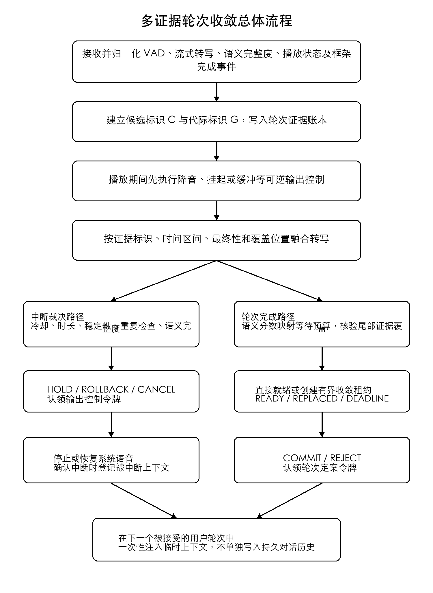
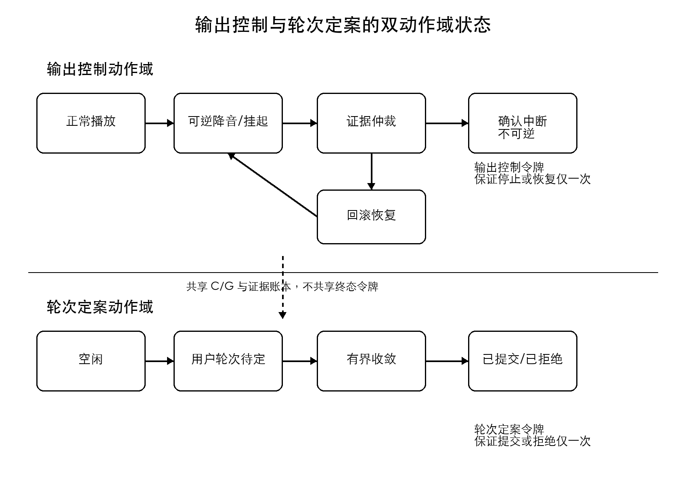
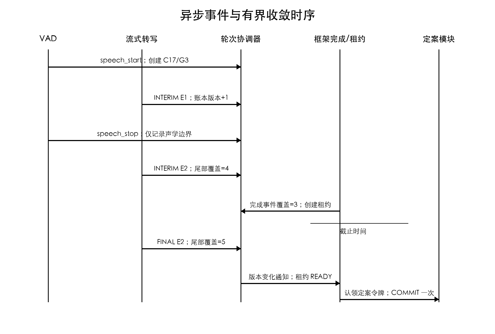
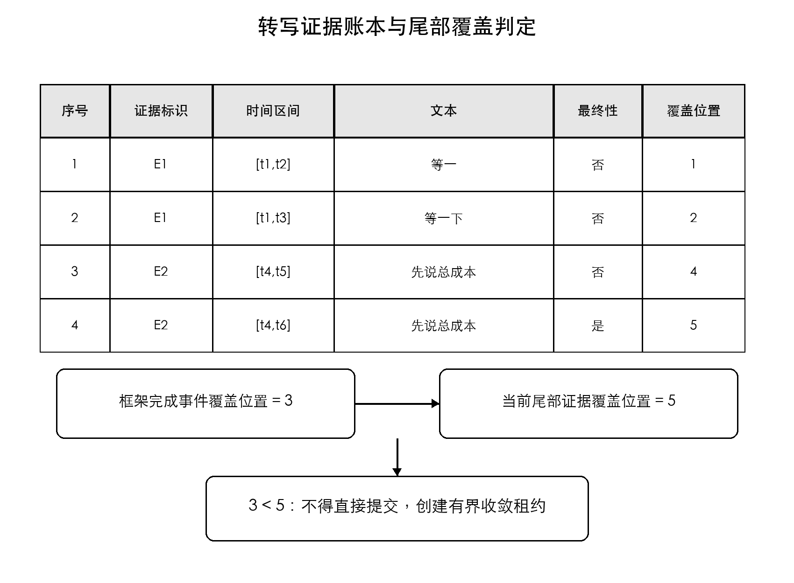
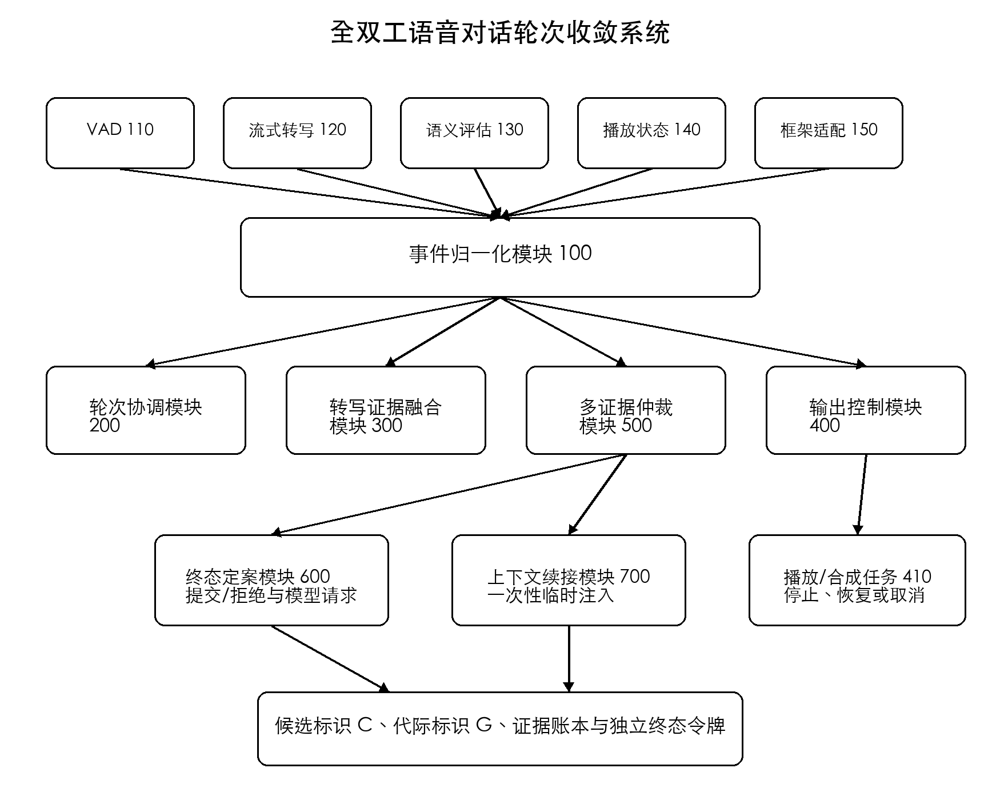

# 一种全双工语音对话的轮次收敛与上下文续接方法

<!-- SECTION:说明书摘要 -->

本发明涉及流式语音交互技术领域，公开一种全双工语音对话的轮次收敛与上下文续接方法。该方法将语音活动、流式转写修订、语义完整度、播放状态及轮次完成事件归一化到带有候选标识和代际标识的轮次证据账本；在用户于系统播放期间发声时先执行降音、挂起或缓冲等可逆控制，根据语义完整度调整证据等待预算，并对转写尾部覆盖进行有界收敛；在对应动作域内原子认领终态令牌后，仅执行一次停止、恢复、提交或拒绝操作。当系统输出被确认中断时，记录已播放偏移和响应摘要，并仅在下一个被接受轮次的临时上下文中消费一次。本发明可降低误中断、重复请求及对话历史污染，并为异步转写提供有界的轮次终态。

<!-- SECTION:摘要附图 -->

图1

<!-- SECTION:权利要求书 -->

1、一种全双工语音对话的轮次收敛与上下文续接方法，其特征在于，包括：接收语音活动检测事件、流式语音转写修订事件、语义完整度评估结果、系统语音播放状态和对话框架完成事件，对所述各事件配置单调序号和时间标记；响应于用户语音开始事件建立用户轮次候选对象，为所述用户轮次候选对象分配候选标识和代际标识，并将后续事件按照所述候选标识、代际标识及单调序号写入轮次证据账本；当所述用户语音开始事件发生于系统语音播放期间时，对当前系统语音执行降音、挂起和缓冲中的至少一项可逆输出控制，并将所述可逆输出控制与所述用户轮次候选对象绑定；基于转写证据标识、转写时间区间、最终性标记和证据覆盖标识，对同一用户轮次候选对象的中间转写与最终转写进行替换、去重或追加，得到候选转写文本及尾部证据覆盖位置；基于所述候选转写文本得到语义完整度，利用所述语义完整度确定证据等待预算，并将语义完整度、语音活动稳定性、转写最终性、冷却状态及重复证据检测结果输入中断裁决路径，以获得保持、回滚或确认中断的中断裁决；响应于所述对话框架完成事件，将该对话框架完成事件的证据覆盖位置与所述尾部证据覆盖位置进行比较，在未覆盖尾部证据时创建与所述候选标识及代际标识绑定的有界收敛租约，并在证据就绪、候选对象被替换或收敛截止时间到达之一发生时生成轮次终态；以及，针对输出控制动作域和轮次定案动作域分别原子认领对应的终态副作用令牌，使确认中断或回滚动作在输出控制动作域内执行一次，使轮次提交或轮次拒绝动作在轮次定案动作域内执行一次；在确认中断动作执行时建立包含被中断系统响应标识、响应文本及已播放偏移的中断上下文记录，并将所述中断上下文记录仅注入下一个被接受用户轮次的临时推理上下文中一次。

2、根据权利要求1所述的方法，其特征在于，所述用户轮次候选对象至少包括：候选标识、代际标识、候选状态、语音活动区间集合、转写证据集合、尾部证据覆盖位置、证据等待预算、输出控制令牌状态和轮次定案令牌状态；当已定案候选对象之后又到达新事件，或者新的语音活动不满足合并条件时，保持候选标识的会话关联关系并递增代际标识，以使旧代际的延迟事件不能改变新代际的状态。

3、根据权利要求1所述的方法，其特征在于，所述对中间转写与最终转写进行替换、去重或追加，包括：对具有相同转写证据标识的修订事件，以单调序号较大的修订事件替换在先事件；对转写时间区间重叠且转写证据标识不同的修订事件，依次按照最终性标记、单调序号和覆盖范围确定保留内容；对转写时间区间不重叠的修订事件按时间顺序追加；以及，将转写证据集合已覆盖的最大时间位置或最大序号作为所述尾部证据覆盖位置。

4、根据权利要求1所述的方法，其特征在于，对所述语义完整度评估结果设置轮次完成路径和中断裁决路径；在所述轮次完成路径中，将语义完整度映射为介于最小等待时间与最大等待时间之间的证据等待预算，并在最终性标记为真时缩短所述证据等待预算；在所述中断裁决路径中，依次执行冷却检查、最小发声时长检查、语音活动稳定性检查、重复证据检查和语义完整度检查，且语义完整度评估结果不单独触发轮次提交。

5、根据权利要求1所述的方法，其特征在于，所述可逆输出控制包括：保存系统语音播放位置，将系统语音的播放增益降低至预设增益或暂停向终端发送后续音频帧，并在缓冲区保留从所述播放位置开始的至少一部分音频帧；当中断裁决为回滚时，从所述播放位置或缓冲区中的可恢复位置继续播放；当中断裁决为确认中断时，在输出控制动作域的终态副作用令牌认领成功后，停止终端播放并取消对应的系统语音合成或发送任务。

6、根据权利要求1所述的方法，其特征在于，所述有界收敛租约包括租约标识、候选标识、代际标识、创建时的证据版本、需要覆盖的尾部证据覆盖位置和收敛截止时间；所述有界收敛租约不以固定周期轮询证据，而是等待所述轮次证据账本的版本变化通知；在通知后当对话框架完成事件已覆盖所述尾部证据覆盖位置时输出就绪结果，当候选标识或代际标识不再匹配时输出候选对象被替换结果，当到达所述收敛截止时间时输出截止结果。

7、根据权利要求1所述的方法，其特征在于，当前一语音活动停止事件与后一语音活动开始事件之间的间隔不大于合并宽限，且前一用户轮次候选对象处于未定案状态时，将后一语音活动区间及其转写证据合并到前一用户轮次候选对象；所述中断上下文记录还包括有效期和消费标记，仅当下一个被接受用户轮次的候选标识或代际标识与该中断上下文记录的绑定条件相符且未超过有效期时，将该中断上下文记录注入临时推理上下文，在注入后设置消费标记，且不将该中断上下文记录单独写入持久对话历史。

8、一种全双工语音对话的轮次收敛与上下文续接系统，其特征在于，包括：事件归一化模块，用于接收语音活动检测事件、流式语音转写修订事件、语义完整度评估结果、系统语音播放状态和对话框架完成事件，并为所述事件配置单调序号和时间标记；轮次协调模块，用于建立具有候选标识和代际标识的用户轮次候选对象，以及维护轮次证据账本；转写证据融合模块，用于基于转写证据标识、转写时间区间、最终性标记和证据覆盖标识对流式转写进行替换、去重或追加；输出控制模块，用于对正在播放的系统语音执行可逆输出控制，并在获得输出控制动作域的终态副作用令牌后执行确认中断或回滚；多证据仲裁模块，用于将语义完整度映射为证据等待预算，生成中断裁决，并通过有界收敛租约生成轮次终态；终态定案模块，用于在获得轮次定案动作域的终态副作用令牌后将候选转写文本提交为用户请求或者拒绝该用户轮次候选对象；以及上下文续接模块，用于建立中断上下文记录，并将该中断上下文记录仅注入下一个被接受用户轮次的临时推理上下文中一次。

9、一种电子设备，包括处理器、存储器、音频输入接口和音频输出接口，所述存储器中存储有计算机程序，其特征在于，所述计算机程序被所述处理器执行时，使所述电子设备执行权利要求1至7中任一项所述的方法。

10、一种非暂态计算机可读存储介质，其上存储有计算机程序，其特征在于，所述计算机程序被处理器执行时，实现权利要求1至7中任一项所述的方法。

<!-- SECTION:说明书 -->

# 一种全双工语音对话的轮次收敛与上下文续接方法

## 技术领域

本发明涉及语音信号处理、流式语音识别和人机对话控制技术领域，具体涉及一种在系统语音输出与用户语音输入并行的全双工对话中，对多源异步事件进行统一建模、转写证据收敛、输出中断控制、用户轮次定案及被中断上下文续接的方法、系统、设备及存储介质。

## 背景技术

全双工语音对话允许系统播放语音的同时继续接收用户语音。与半双工或按键对讲方式相比，该方式可支持用户随时打断、更正或补充条件。然而，全双工链路中的语音活动检测、流式语音识别、语义完整度评估、系统语音播放和对话框架终态通常由不同线程、进程或远程服务产生，各事件的到达顺序与其所表征的实际语音时序可能不一致。

现有方案通常在检测到用户声音时立即停止系统语音，或者在检测到一段静音后立即将当前转写提交给生成模块。回声、环境噪声、短促应答或用户的语气词可因此导致误中断；而用户在短暂停顿后继续补充的语句，则可被拆分为两个请求，引起重复模型调用、相互矛盾的响应以及额外的音频合成与网络传输。

流式语音识别还可对同一音频区间连续输出多个中间结果，并在后续事件中替换词语、补全尾部或改变断句。若只根据事件到达时间追加文本，可能产生重复文本；若在收到对话框架完成事件时立即提交，又可能遗漏已在途中的尾部转写。单纯延长静音阈值虽可降低部分截断，但会增大所有轮次的响应延迟，且仍不能解决延迟事件误作用于新轮次的问题。

另外，中断系统语音与提交用户请求是两类不同的终态动作。前者关系到正在播放的音频、合成任务和发送队列，后者关系到对话历史、模型请求与下一次响应。若由多个回调各自处理，重复到达或乱序到达可导致二次取消、二次提交或先恢复后停止等冲突。被中断系统响应中已经播放给用户的内容如未被后续推理感知，系统可重复前文；若将中断提示长期写入对话历史，又会使之后的无关轮次持续受到影响。

因此，需要一种技术方案，在不依赖特定语音识别服务商的情况下，对上述异步证据进行具有代际隔离的统一收敛，并在误中断率、轮次完整性和交互延迟之间建立可控的技术边界。

## 发明内容

本发明的目的在于提供一种全双工语音对话的轮次收敛与上下文续接方法，以解决多源语音事件异步到达时的误中断、转写尾部丢失、轮次拆分、重复终态副作用和上下文污染问题。

为实现上述目的，本发明将语音活动检测事件、流式语音转写修订事件、语义完整度评估结果、系统语音播放状态及对话框架完成事件归一化为具有单调序号和时间标记的事件。所述单调序号可由会话内的事件网关分配，用于在两个事件时间标记相同或不可比较时仍建立稳定顺序。

响应于用户语音开始事件，建立用户轮次候选对象，为其分配候选标识和代际标识。候选标识用于表示一个逻辑用户轮次，代际标识用于隔离同一候选标识下因重开、替换或终态后迟到而形成的不同版本。任一异步回调在改变状态前均核验所携带的候选标识和代际标识，从而防止旧代际回调覆盖新代际。

当用户语音发生于系统语音播放期间时，不立即实施不可恢复的取消，而是先降低系统语音播放增益、挂起后续音频帧的终端发送，或将从当前播放位置开始的音频帧保留在可恢复缓冲区。所述操作属于可逆输出控制，不包括向对话历史写入用户请求、发起新模型请求或永久删除缓冲音频。

每个流式转写修订事件至少包括转写证据标识、转写时间区间、转写文本、最终性标记和证据覆盖标识。当服务商提供原生分段标识时，可将该分段标识作为转写证据标识；当服务商不提供原生分段标识时，可基于转写时间区间、音频源标识和规范化文本指纹构造转写证据标识。

转写证据融合按三类规则执行。其一，对具有相同转写证据标识的修订事件，以单调序号较大的事件替换在先事件。其二，对转写时间区间重叠但转写证据标识不同的事件，优先保留最终性标记为真的事件；最终性相同时，优先保留单调序号较大的事件；前两者均相同时，优先保留覆盖范围较大的事件。其三，对不重叠的事件按转写时间区间追加。上述规则使同一音频的中间转写不被反复追加，同时允许最终转写替换中间转写。

尾部证据覆盖位置表示当前转写证据集合已覆盖的最大音频时间位置或最大证据序号。对话框架完成事件携带其据以作出轮次完成判断的覆盖位置。只有当对话框架完成事件的覆盖位置不早于当前尾部证据覆盖位置时，才可直接进入轮次定案；否则创建有界收敛租约。

有界收敛租约通过轮次证据账本的版本变化通知被唤醒，而不需要高频轮询。每次唤醒后，首先核验候选标识和代际标识，然后比较覆盖位置。当覆盖条件满足时，输出证据就绪结果；当候选对象被替换时，输出候选对象被替换结果；当硬截止时间到达时，根据已有最终性标记、稳定文本长度及语音活动状态生成提交或拒绝结果。由此在等待延迟最终转写的同时，为任一候选轮次提供确定的最长收敛时间。

语义完整度可由基于文本的分类器、序列模型、多模态模型或规则与模型组合估计，取值范围为零至一。本发明对所述评估结果设置两个用途不同的路径。在轮次完成路径中，语义完整度越高，证据等待预算越短，但其不直接产生轮次提交。在中断裁决路径中，语义完整度仅在冷却、最小发声时长、语音活动稳定性和重复证据检查通过后才用于确定是否确认中断。

在一种实现中，可将语义完整度划分为高、中、低三个区间，分别对应快速、标准和深度证据等待预算。在另一种实现中，可将语义完整度经单调递减函数映射到最小等待时间与最大等待时间之间，并在收到最终转写时对等待预算施加不大于一的缩短系数。两种方式均保持最小等待时间和最大等待时间的硬边界。

中断裁决可包括保持、回滚和确认中断。保持表示继续维持当前的可逆输出控制并等待新证据；回滚表示将当前发声视为噪声、回声或不构成打断的短应答，并恢复系统语音；确认中断表示停止系统语音播放，取消对应的合成或发送任务，但不因此自动提交尚未收敛的用户转写。

本发明将输出控制动作域与轮次定案动作域分离。输出控制动作域包括确认中断和回滚；轮次定案动作域包括轮次提交和轮次拒绝。每个动作域配置独立的终态副作用令牌，并通过比较并置换、互斥锁或事务性状态更新完成原子认领。认领失败的重复回调仅记录幂等结果，不重复执行停止、恢复、提交或拒绝动作。

当确认中断被执行时，上下文续接模块建立中断上下文记录。该记录可包括被中断系统响应标识、响应文本、已播放偏移、已播放文本摘要、建立时间、有效期、绑定的候选标识或代际标识以及消费标记。当导致中断的用户轮次最终被接受时，将该记录作为临时系统上下文注入本次推理，使生成模块知道用户已听到的内容和未听到的内容。注入完成后立即设置消费标记，且不将该记录作为独立历史消息持久存储。

在同一逻辑用户轮次内，若前一语音活动停止事件与后一语音活动开始事件的间隔不大于合并宽限，且前一候选对象尚未定案，则将两段语音活动及对应转写证据合并到同一候选对象。该合并机制用于处理用户因呼吸、思考、自我更正或网络抖动形成的短间隔连续发声。对于前一候选对象已经定案，或间隔超过合并宽限的情况，创建新候选对象或新代际，而不追加到已提交文本。

本发明还提供一种全双工语音对话的轮次收敛与上下文续接系统，包括事件归一化模块、轮次协调模块、转写证据融合模块、输出控制模块、多证据仲裁模块、终态定案模块和上下文续接模块。各模块可部署在同一计算设备，也可分布于终端、边缘节点和服务器，通过带有会话标识、候选标识及代际标识的消息交换数据。

与现有技术相比，本发明具有以下有益效果：

第一，通过在判定确认中断之前执行可逆降音、挂起或缓冲，可在保持用户插话感受的同时，为回声、噪声和短应答的回滚保留音频恢复能力。

第二，通过候选标识、代际标识、转写证据标识和覆盖位置的联合约束，可隔离迟到事件，消除同一音频区间的转写重复，并避免未覆盖尾部证据的过早提交。

第三，语义完整度仅调整证据等待预算，中断裁决另外受冷却、时长、语音活动稳定性和重复检查限制，而轮次提交仍由证据覆盖收敛路径完成，因此可减少单一模型分数抖动导致的误提交。

第四，有界收敛租约通过版本变化通知等待新证据，可减少固定周期轮询带来的处理器唤醒，同时用硬截止时间避免候选轮次无限期挂起。

第五，将输出控制与轮次定案设置为两个动作域，并对每个动作域的终态副作用令牌进行原子认领，可避免重复取消合成、重复恢复播放、重复调用生成模块以及重复写入对话历史。

第六，被中断系统响应的已播放信息仅在下一个被接受轮次的临时推理上下文中消费一次，可使后续响应续接用户已听内容，同时避免中断提示长期污染对话历史。

## 附图说明

为了更清楚地说明本发明实施方式的技术方案，下面对实施方式中所需要使用的附图作简要介绍。以下附图用于说明本发明的技术原理，不构成对保护范围的限定。

图1是本发明方法的总体流程图。

图2是本发明中输出控制状态与轮次定案状态的双动作域状态图。

图3是本发明中语音活动事件、流式转写修订事件、对话框架完成事件和有界收敛租约的时序图。

图4是本发明中转写证据账本及尾部覆盖判定的结构图。

图5是本发明系统的模块结构图。

## 具体实施方式

下面结合附图对本发明的实施方式进行清楚、完整地说明。所描述的实施方式是本发明的部分实施方式，而不是全部实施方式。在不冲突的情况下，下述实施方式及其中的技术特征可以相互组合。

### 术语及数据结构

本实施方式中，“轮次”是指从一个用户语音开始事件起，到该次用户输入被提交或被拒绝为止的逻辑处理单元。“轮次候选对象”是尚未定案的轮次数据结构。“代际”是轮次候选对象的版本隔离维度。“定案”是将轮次候选对象转变为已提交或已拒绝终态。

“对话框架完成事件”是指由端点管理模块、语音识别框架或对话会话管理器产生的、表明某一用户轮次已满足上层完成条件的事件。该事件不限于任一特定开发框架，但需要关联候选标识、代际标识以及作出完成判断时的证据覆盖位置。

轮次证据账本可以表示为与候选标识和代际标识关联的有序记录集合。记录类型包括语音活动开始、语音活动停止、中间转写、最终转写、语义完整度、播放状态、对话框架完成、中断裁决、租约结果和终态动作结果。账本每发生一次有效变化就递增版本号并唤醒等待该版本变化的收敛租约。

输出控制令牌和轮次定案令牌均可采用“未认领、已由事件标识认领、已完成”三态结构。任一执行者需先将“未认领”原子地更新为“已由事件标识认领”，再执行对应副作用。若设备在副作用完成前故障，可根据事件标识和执行结果记录进行幂等恢复，而不由另一事件无条件重复执行。

### 核心算法的数学化描述

为便于说明轮次收敛、中断裁决、级联片段合并和一次性上下文续接之间的约束关系，将第i个异步证据事件表示为：

$$
e_i=(s_i,\tau_i,C_i,G_i,k_i,p_i,x_i,F_i)
$$

其中，sᵢ表示事件源或事件类型，τᵢ表示事件时间，Cᵢ和Gᵢ分别表示候选标识和代际标识，kᵢ表示同一证据源内的单调序号，pᵢ表示证据覆盖位置，xᵢ表示证据载荷，Fᵢ表示最终性标记。对于候选C、代际G以及账本版本v，对应的有序证据账本表示为：

$$
L_{C,G}^{(v)}=\operatorname{sort}_{k_i}\{e_i\mid C_i=C\land G_i=G\land k_i\leq v\}
$$

对于具有相同证据标识的事件，仅保留单调序号较大的修订；对于时间区间重叠的不同证据，依次按照最终性、单调序号和覆盖范围确定优先级；对于互不重叠的证据则按时间顺序连接。由此可避免将同一中间转写及其修订版本重复拼接。将对话框架完成事件所携带的覆盖位置记为框架覆盖位置，账本尾部覆盖位置和证据就绪判定分别为：

$$
p_{\mathrm{tail}}(C,G,v)=\max_{e_i\in L_{C,G}^{(v)}}p_i
$$

$$
R(C,G,v)=\mathbf{1}[p_f\geq p_{\mathrm{tail}}(C,G,v)]
$$

当R等于1时，框架完成事件已经覆盖当前账本尾部；当R等于0时，终态定案模块继续等待账本版本变化，但不会据此重复停止输出。令q属于区间[0,1]并表示语义完整度，F属于集合{0,1}并表示是否存在最终转写，ρ属于区间[0,1]并表示最终性对等待预算的缩减系数，则深度证据等待预算可表示为：

$$
B(q,F)=\operatorname{clip}\big(B_{\min}+(B_{\max}-B_{\min})(1-q)(1-\rho F),B_{\min},B_{\max}\big)
$$

该式使等待预算始终有界，并使语义完整度较高或已有最终转写时减少额外等待。该预算仅确定证据租约的截止时间，不单独构成提交条件。令h表示用户语音活动是否连续稳定，d表示发声持续时间，s表示用户语音相对于回声残留的信号优势，n=1-sim(T,P)表示候选文本T相对于近期播放文本P的新颖度，则确认中断判定可以表示为：

$$
I=\mathbf{1}[h=1\land d\geq d_{\min}\land s\geq\theta_s\land n\geq\theta_n\land q\geq\theta_q]
$$

当I等于1时，输出控制动作域可执行确认停止；当最小持续时间或新颖度条件不满足时执行回滚；其余情况保持软降音并等待新增证据。以框架完成事件到达时刻作为租约起算时刻，则租约截止时刻满足：

$$
t_d=t_f+B(q,F)
$$

在租约截止时刻之前，只要账本版本变化就重新计算R；若候选或代际已被替换则输出“已替换”，若R变为1则输出“证据就绪”，仅在二者均不成立且达到租约截止时刻时输出“截止时间到达”。

为约束并发回调产生的副作用，令a属于集合{out,fin}并分别表示输出控制动作域和轮次定案动作域，zₐ为相应动作令牌，原子认领及副作用条件表示为：

$$
\operatorname{claim}_a(e)=\operatorname{CAS}(z_a,\varnothing,e),\qquad \operatorname{effect}_a(e)\Leftrightarrow \operatorname{claim}_a(e)=1
$$

因此，同一动作域内只有原子认领成功的事件能够产生一次副作用，而输出停止与轮次提交仍可分别发生。对于相邻语音片段，令Δt表示前一语音停止至后一语音开始的时间差，γ表示合并宽限，z表示当前轮次状态，(C*,G*)表示当前活动候选及代际，则级联片段合并判定为：

$$
M=\mathbf{1}[\Delta t\leq\gamma\land z\notin\{\mathrm{COMMITTED},\mathrm{REJECTED}\}\land(C,G)=(C^*,G^*)]
$$

令cᵣ表示响应r的一次性续接上下文是否已消费，tₑₓₚ表示其有效期，bind(r,C,G)表示该上下文仍绑定于当前活动候选及代际，则一次性注入条件表示为：

$$
U=\mathbf{1}[\neg c_r\land t\leq t_{\mathrm{exp}}\land\operatorname{bind}(r,C,G)]
$$

U等于1时，仅将最小必要的未播报边界、被中断响应标识和续接意图注入本轮生成上下文，并原子地将cᵣ置为已消费；该上下文不写入持久对话历史。上述数学表达用于刻画本发明各变量的约束关系和事件驱动判定链条，不将实现限定为特定阈值、概率模型或编程语言。

### 实施例一 跨语音片段的轮次收敛

请参阅图1、图3和图4。本实施例以系统正在语音播报旅行方案，用户连续说出“等一下”和“先说总成本”为例说明处理过程。下述时间参数用于说明一种实现，可根据终端音频帧长、网络延迟及语音识别服务的修订频率调整。

在时刻t0，输出控制模块记录系统响应标识R21、当前播放偏移1.8秒和可恢复缓冲区的起点。在时刻t1，语音活动检测模块输出用户语音开始事件。轮次协调模块创建候选标识C17和代际标识G3，将其状态设置为“用户发声已开启”，并将播放增益降低至预设增益。

在时刻t2，流式语音识别模块输出中间转写“等一”，其转写证据标识为E1，时间区间为[t1,t2]，最终性标记为假，证据覆盖标识为1。

在时刻t3，同一转写证据标识E1的转写被修订为“等一下”，因其单调序号较大，该修订替换前一文本，而不追加成“等一等一下”。

在时刻t4，语音活动停止。此时中断裁决路径获得的语义完整度为0.34，且转写尚未最终化，因此裁决为保持。轮次完成路径将该完整度映射到深度证据等待预算，但不提交“等一下”作为独立用户请求。

在t4后420毫秒，用户再次发声并说出“先说总成本”。若合并宽限设为800毫秒，则两次语音活动间隔不大于合并宽限，且C17/G3仍处于未定案状态。轮次协调模块因此将第二语音活动区间及对应转写证据E2合并到C17/G3，得到候选转写“等一下，先说总成本”。

在时刻t5，语义完整度上升至0.86，且语音活动已连续稳定、发声时长超过最小值、内容与系统已播放文本的前缀相似度低于重复阈值，中断裁决路径输出确认中断。输出控制模块原子认领C17/G3的输出控制令牌，停止R21的终端播放并取消对应的合成或发送任务。其他重复的语音停止回调或转写最终化回调因无法认领已占用令牌，不再执行停止。

在时刻t6，对话框架完成事件到达，其覆盖位置为3；但轮次证据账本的尾部证据覆盖位置已为4，表明完成事件未覆盖后到的转写修订。多证据仲裁模块创建收敛截止时间为t6加1.2秒的有界收敛租约，并等待证据账本版本变化。

在t6后180毫秒，最终转写证据E2到达，覆盖位置更新为5，对话框架完成事件的覆盖位置同步至5。租约被版本变化通知唤醒并输出证据就绪结果。终态定案模块原子认领C17/G3的轮次定案令牌，将完整候选转写提交一次并启动一次响应生成。

上述过程中，输出控制令牌和轮次定案令牌分属不同动作域。因此，系统可在用户意图足以确认中断时尽快停止旧响应，同时继续等待尾部转写收敛后再提交新用户请求。

### 实施例二 误中断回滚与真实更正

请参阅图2。本实施例以系统正在说出“明天北京的最高温度是……”为例。用户首先发出时长120毫秒的“嗯”。语音活动开始后，输出控制模块立即对系统语音执行软降音并保存播放位置，但不取消合成任务。

中断裁决路径首先执行最小发声时长检查。由于120毫秒低于本实施例的250毫秒最小值，或者该转写与系统近期播放文本具有高前缀相似度，裁决为回滚。输出控制模块在认领输出控制令牌后，撤销降音并从可恢复位置继续播放。该候选对象被拒绝，不发起模型请求，也不写入对话历史。

稍后，用户说出“不对，改成上海”。对于新建的候选对象，发声时长、语音活动稳定性和语义完整度均达到相应条件，且转写不属于系统播放内容的重复前缀，因此输出确认中断。此时取消旧响应的播放、合成或发送任务，并创建中断上下文记录。

中断上下文记录可记载系统响应标识R22、已播放偏移1.1秒、用户已听到文本“明天北京的最高温度”、用户尚未听到的响应摘要、有效期及未消费标记。当“不对，改成上海”所在轮次收敛且被提交时，上下文续接模块将该记录转换为临时推理指示，例如表明用户在系统说到北京温度时进行了更正。生成模块因此可从上海的天气继续响应，而无需重复已播放的北京内容。

临时推理指示注入后，对中断上下文记录的消费标记执行原子更新。即使后续发生模型重试或转写回调重放，也不再将该记录注入其他轮次。当记录超过有效期或绑定的候选对象被拒绝时，可直接作废该记录。

### 实施例三 延迟最终转写与候选代际替换

请参阅图3和图4。本实施例说明对话框架完成事件早于最终转写到达，以及候选对象在等待期间被替换的情况。

候选对象C31/G1的转写证据账本已包含覆盖位置1至6的中间转写。

对话框架完成事件F1在时刻t1到达，其完成判断仅覆盖至位置5。该事件不直接产生轮次提交，而是创建有界收敛租约L31，其需要覆盖的尾部位置为6，收敛截止时间为t1加预设最长等待时间。

在第一种情况下，最终转写事件在收敛截止时间之前到达，并将完成事件的覆盖位置更新为6。证据账本版本变化通知唤醒L31，L31核验C31/G1仍为当前候选对象，并输出证据就绪。轮次定案动作域的令牌被认领后，候选文本仅被提交一次。

在第二种情况下，新的语音活动不满足与C31/G1合并的条件，轮次协调模块创建C31/G2或新候选标识C32。证据账本的版本变化通知唤醒L31后，L31检测到候选标识或代际标识不再匹配，因而输出候选对象被替换并终止等待。之后即使C31/G1的最终转写到达，也只能记录为迟到证据，不能改变C31/G2或C32的状态。

在第三种情况下，在收敛截止时间之前未收到覆盖尾部位置6的最终转写。L31在截止时间到达时检查已有证据。若已存在稳定且达到最小内容条件的最终转写，可以该最终转写作为提交文本；若只有短促、重复或不稳定的中间转写，则拒绝该候选对象并回滚可逆输出控制。由此保证在服务异常时仍能进入确定终态。

### 实施例四 系统部署与计算设备

请参阅图5。本实施例的系统包括事件归一化模块100、轮次协调模块200、转写证据融合模块300、输出控制模块400、多证据仲裁模块500、终态定案模块600和上下文续接模块700。

事件归一化模块100接收来自语音活动检测器110、流式语音识别器120、语义完整度评估器130、音频播放器140和对话框架适配器150的事件。对话框架适配器150将不同框架的轮次完成回调转换为携带候选标识、代际标识和覆盖位置的统一完成事件。

轮次协调模块200维护会话内的当前候选对象、代际计数器和轮次证据账本。转写证据融合模块300向轮次协调模块200输出规范化候选文本和尾部证据覆盖位置。输出控制模块400与音频播放器140及语音合成或发送任务410连接，执行降音、挂起、缓冲、恢复和停止。

多证据仲裁模块500包括轮次完成路径510和中断裁决路径520。轮次完成路径510管理证据等待预算、对话框架完成事件及有界收敛租约；中断裁决路径520管理冷却、最小发声时长、语音活动稳定性、重复证据和语义完整度等条件。两条路径共享同一候选对象的证据，但仅轮次完成路径510能请求终态定案模块600执行轮次提交。

终态定案模块600将已提交的用户文本写入对话历史，并可向响应生成模块610发起请求。上下文续接模块700包括中断上下文帐本710和一次性消费接口720。一次性消费接口720只向本次响应生成请求构造的临时推理上下文输出中断上下文，对持久对话历史不作单独写入。

上述模块可全部运行于具有麦克风、扬声器、处理器和存储器的终端；也可将语音活动检测、播放控制和可恢复缓冲部署于终端或边缘节点，将语音识别、语义完整度评估及响应生成部署于服务器。在分布式部署中，事件消息需携带会话标识、候选标识、代际标识、单调序号和发生时间，以支持跨网络的乱序重排与幂等执行。

计算设备的存储器可包括随机存取存储器、只读存储器、闪存、固态存储器或其他非暂态计算机可读存储介质。处理器可包括中央处理器、数字信号处理器、图形处理器、神经网络处理器或其组合。存储器中存储的计算机程序被处理器执行时，使计算设备实现上述方法。

本领域技术人员应当理解，上述阈值、时间宽限、等待预算和有效期的数值可根据麦克风类型、回声消除能力、终端缓冲长度、网络延迟分布、语音识别服务修订特性和交互场景进行配置或自适应学习。对不同语种也可分别配置最小文本长度及语义完整度映射关系，但不改变候选代际隔离、证据覆盖收敛、可逆控制和分动作域幂等定案的基本技术链条。

以上所述仅为本发明的较佳实施方式，并不用于限制本发明。凡在本发明的精神和原则之内所作的修改、等同替换和改进，均应包含在本发明的保护范围之内。

<!-- SECTION:说明书附图 -->

图1

图2

图3

图4

图5
